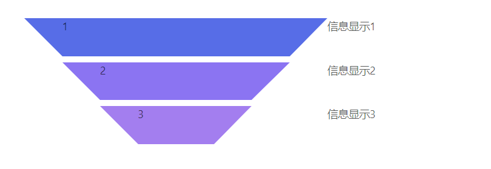

# vue-funnel
 * 这是一个数据漏斗ui组件


## Table of Contents <!-- omit in toc -->

* [介绍](#介绍)

* [示例](#demo)
  * [demo1](#demo1)
  * [demo2](#demo2)

* [参数说明](#参数说明)

* [slots说明](#slots说明)


## 介绍

  - 本组件不依赖任何第三方 _ui组件库_ ,纯粹的支持所有的vue项目工程。
  - 对插槽内容做了加工处理,灵活程度较高

### 安装

```sh
yarn add vue-funnel or npm i vue-funnel
```

[⬆ Back to Top](#table-of-contents)

### demo1
  #### 示例图片
  

  #### 示例code
  ```vue
    <template>
      <div class="vue-funnel-test" style="margin:50px auto;">
        <vue-funnel style="margin:50px 100px;" :colors="colors" :isLeft="true">
          <span>1</span>
          <span>2</span>
          <span>3</span>
          <div slot="info0">信息显示1</div>
          <div slot="info1">信息显示2</div>
          <div slot="info2">信息显示3</div>
        </vue-funnel>
      </div>
  </template>
  <script>
  export default {
    name: 'vue-funnel-test',
    components: {
      'vue-funnel': () => import('@/components/vue-funnel/index')
    },
    data() {
      return {
        colors: ['#576DE7', '#8B74F2', '#A37EEF']
      }
    }
  }
  </script>
  ```

[⬆ Back to Top](#table-of-contents)

### demo2

  #### 示例图片
  

  #### 示例code
  ```vue
    <template>
      <div class="vue-funnel-test" style="margin:50px auto;">
        <vue-funnel style="margin:50px 100px;" :colors="colors" :isLeft="false">
          <span>1</span>
          <span>2</span>
          <span>3</span>
          <div slot="info0">信息显示1</div>
          <div slot="info1">信息显示2</div>
          <div slot="info2">信息显示3</div>
        </vue-funnel>
      </div>
  </template>
  <script>
  export default {
    name: 'vue-funnel-test',
    components: {
      'vue-funnel': () => import('@/components/vue-funnel/index')
    },
    data() {
      return {
        colors: ['#576DE7', '#8B74F2', '#A37EEF']
      }
    }
  }
  </script>
  ```
[⬆ Back to Top](#table-of-contents)

## 参数说明

| 参数      | 说明             | 类型    | 默认值        |
|-----------|------------------|---------|---------------|
| colors    | 梯形背景颜色配置 | Array   | 内置颜色array |
| isLeft    | 漏斗图的位置     | Boolean | true          |
| maxWidth  | 底部梯形的宽度   | Number  | 300           |
| minWidth  | 顶部梯形的宽度   | Number  | 150           |
| rowHeight | 梯形高度         | Number  | 50            |
| rowSpace  | 梯形间距         | Number  | 8             |

[⬆ Back to Top](#table-of-contents)

## slots说明

| name                                        | 说明                                   |
|---------------------------------------------|----------------------------------------|
| -                                           | 默认插槽，用于显示梯形里面的自定义内容 |
| info${rowIndex->行索引值}                   | 用于自定义显示同一行的内容             |
| arrow-${left or right}${rowIndex->行索引值} | 用于显示两侧三角形的自定义内容         |

[⬆ Back to Top](#table-of-contents)
